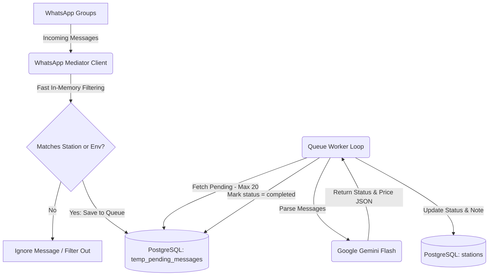

# WhatsApp Message Mediator

A high-performance background daemon built with Node.js and TypeScript. It connects to WhatsApp, listens to registered CNG pump updates, filters out unrelated chats, and processes status messages in batches using Google Gemini AI to update a PostgreSQL database.

---

## 1. System Architecture

The mediator processes incoming group messages, filters them instantly in memory, queues them in a database, and resolves updates via an asynchronous AI worker.



---

## 2. Database Models (Sequelize)

The mediator connects to a shared PostgreSQL database and interacts with the following models:

### `Station` (`stations` table)
Used by the mediator to read registered pump names/JIDs for filtering, and update current CNG availability.
*   **`id`** (UUID, Primary Key): Unique identifier of the pump.
*   **`station_name`** (VARCHAR): Official name of the station.
*   **`display_name`** (VARCHAR): WhatsApp group name of the pump (used for matching).
*   **`group_jid`** (VARCHAR, Unique, Nullable): Automatically resolved WhatsApp group JID.
*   **`is_cng_available`** (BOOLEAN): Current CNG status (open/closed).
*   **`price`** (DECIMAL): Current CNG price per kg.
*   **`note`** (TEXT): Verbatim original WhatsApp message text.
*   **`last_updated`** (TIMESTAMP): Time of the last update.

### `PendingMessage` (`temp_pending_messages` table)
A queue table synchronized automatically at boot time with `{ alter: true }` to maintain schema integrity.
*   **`id`** (INTEGER, Primary Key, Auto-Increment)
*   **`station_id`** (UUID, Nullable): Links the queued message to the matched station.
*   **`message_id`** (VARCHAR, Unique): Unique message ID used to prevent duplicates.
*   **`sender_jid` / `sender_name`** (VARCHAR): Information on the sender.
*   **`group_jid` / `group_name`** (VARCHAR): Source group details.
*   **`message_text`** (TEXT): Raw message text content.
*   **`timestamp`** (TIMESTAMP): Time the message was sent on WhatsApp.
*   **`status`** (VARCHAR, Default 'pending'): Can be `pending`, `completed`, or `failed`.

---

## 3. Directory Layout

```text
whatsapp/
├── src/
│   ├── config/             # Config loader, env variables, and Zod schemas
│   ├── errors/             # Global error handler and custom AppError class
│   ├── handlers/           # MessageHandler (caching & JID self-healing logic)
│   ├── logger/             # Pino logger setup (app.log & console logs)
│   ├── services/
│   │   ├── ai/             # GeminiService (API key verification & structured JSON parser)
│   │   ├── database/       # Sequelize database service and ORM models
│   │   ├── queue/          # QueueWorker background polling loop
│   │   └── whatsapp/       # Baileys client wrapper and event listener
│   ├── utils/              # Message formatting & normalizers
│   └── index.ts            # Entrypoint (bootstraps database, cache, and client)
├── tsconfig.json           # TypeScript configuration rules
└── package.json            # Node scripts and project dependencies
```

---

## 4. Key Workflows & Lifecycle

### 1. Boot-Up Cache Initialization
*   Loads all registered pump names, display names, and group JIDs from the `stations` table into an in-memory `allowedGroupsCache` Set.
*   Ensures that unrelated personal or family chats are ignored instantly at O(1) speed without hitting the database, preserving database pool resources.

### 2. WhatsApp Ingestion & JID Self-Healing
*   When a group message is received, the mediator matches the source group against the cache.
*   If a match is found based on name, but the station record has `group_jid = NULL` in the database, the mediator automatically updates it with the message's group JID and refreshes the cache.

### 3. Background Queue Worker & Gemini AI Parsing
*   Every 5 seconds, the `QueueWorker` pulls up to 20 pending messages linked to a station.
*   Submits messages to **Google Gemini 1.5/3.5 Flash** (`gemini-flash-latest`).
*   Configures `thinkingConfig: { thinkingBudget: 0 }` to disable thinking latency, achieving API responses in < 1.5 seconds.
*   Updates `is_cng_available`, `price`, `last_updated`, and saves the **exact original message text** into the station's `note` field before marking the queue items as `completed`.

---

## 5. Configuration & Setup Guide

### Environment Variables (`.env`)
Create a `.env` file in the root of the project with:
```env
NODE_ENV=development
LOG_LEVEL=info
DB_HOST=localhost
DB_USER=postgres
DB_PASSWORD=postgres
DB_NAME=cnglive
DB_PORT=5432
ALLOWED_GROUPS=            # Optional fallback allowed group list
GEMINI_API_KEY=AIzaSy...    # Google AI Studio API Key
QUEUE_POLL_INTERVAL_MS=5000 # Queue polling loop interval (5 seconds)
```

### Installation and Execution

```bash
# 1. Install dependencies
npm install

# 2. Build TypeScript
npm run build

# 3. Run application in development mode
npm run dev
```
